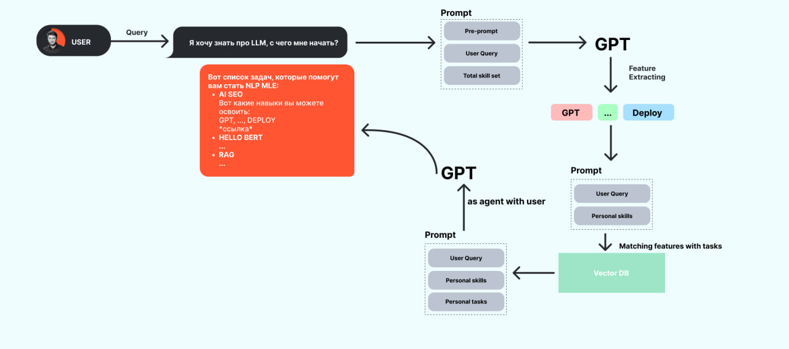

# ML System Design Doc - [RU]
## Дизайн ML системы сервиса Navigator

> ## Термины и пояснения
> - Итерация - это все работы, которые совершаются до старта очередного пилота
> - БТ - бизнес-требования
> - `Product Owner`,  `Data Scientist` - роли, которые заполняют соответствующие разделы
### 1. Цели и предпосылки
#### 1.1. Зачем идем в разработку продукта?

- **Бизнес-цель:**
  - Большинство студентов ML симулятора часто спрашивают о том какие задачи и пет проекты следует освоить в первую очередь. Требуется построить сервис для помощи студентам в освоении материалов курса и персонализированных рекомендациях по их вопросам связанных с выбором задач и пет проектов.
- **Проблематика:**
  - У новых студентов отсутсвует понимание какие задачи и пет проекты следует освоить в начале для того чтобы развить определённый скилл, чтобы наиболее эффективно развиваться.
  - Существуют студенты, успешно освоившие материалы курса, которые не могут самостоятельно определиться с выбором тематики своего первый рабочего проекта.
- **Преимущества использования ML:**
  - LLM-based подходы способны на генерализацию и персонализацию контекста связанным с общением с пользователем. **[[1]](https://www.youtube.com/watch?v=AKMuA_TVz3A)**
  - LLM модели так-же можно использовать как feature extraction, что бы улучшить результаты семантического поиска с имеющимися материалами и запросами пользователя. **[[2]](https://ssanner.github.io/papers/recsys23_llmrec.pdf)** **[[3]](https://realty.ya.ru/realty-gpt-chat/?source=105)**
- **Критерии успеха:**
  - Позитивные реакции пользователей и так же активное использование сервиса.

#### 1.2. Бизнес-требования и ограничения

- **Краткое описание бизнес требований**
  - Проект представляет собой сервис для взаимодействия со студентами ML симулятора и предоставления рекомендации по выбору задач и пет проектов.
  - Сервис хранит в себе описания проектов и задач, который матчиться с запросом пользователя.
  - Из запроса пользователя генерируются признаки для большего покрытия с задачами.
- **Бизнес-ограничения**
  - Доступ к использованию API сервисов
  - Доступ к платформе SimulatorML
- **Итерации проекта**
  - Первая итерация:
    > Создание POC на основе GPTs для проверки гипотез на пользователях. А так-же сбор фитбека от пользователей.
  - Вторая итерация:
    > Разработка MVP сервиса с использованием LLMs, Векторной базы данных, сбор обратной связи от пользователей.
  - Третья итерация:
    > Тестирование сервиса в реальных условиях с ограниченным количеством пользователей.
  - Четвертая итерация:
    > Публикация статьи сервиса в различных сообществах и его поддержка.
- **Описание бизнес-процесса пилота**
  - Сервис предоставляет рекомендации по выбору задач и пет проектов, а его ответы пользователям имеют достаточную полноту и разнообразие проекта.
  - Тестирование системы в реальных условиях с ограниченным количеством пользователей.
  - Сбор обратной связи от пользователей для улучшения системы.

#### 1.3. Что входит в скоуп проекта/итерации, что не входит
- Что не будет закрыто `Data Scientist`
  - Интеграция с сервисом SimulatorML
- Описание результата с точки зрения качества кода и воспроизводимости решения `Data Scientist`
  - Покрытие тестов по всему коду с помощью pytest
  - Использование документации и дизайн документа
  - Код воспроизводим локально, в docker, а так-же github actions
  - Использование Numpy Docstring для авто-документации
  - Использование Ruff и pre-commits как линтер и форматтер
- Описание планируемого технического долга (что оставляем для дальнейшей продуктивизации)
  - Промпт инженерия
  - Интеграция с Базой Данных

### 2. Методология `Data Scientist`

#### 2.1. Постановка задачи

- Сервис LLM-Based семантический поиск/матчинг запроса пользователя и описания задач, а так же LLM агента для взаимодействия пользователя.

#### 2.2. Блок-схема решения

- Блок-схема для бейзлайна и основного MVP с ключевыми этапами решения задачи

#### 2.3. Этапы решения задачи `Data Scientist`

- Для каждого этапа **по результатам EDA** описываем - **отдельно для бейзлайна** и **отдельно для основного MVP** - все про данные и технику решения максимально конкретно. Обозначаем необходимые вводные, технику предполагаемого решения и что ожидаем получить на выходе, чтобы перейти к следующему этапу.
- Как правило, детальное и структурированное заполнение раздела `2.3` возможно только **по результатам EDA**.
- Если описание в дизайн доке **шаблонно** - т.е. его можно скопировать и применить к разным продуктам, то оно **некорректно**. Дизайн док должен показывать схему решения для конкретной задачи, поставленной в части 1.

> Примеры этапов:
> - Этап 1 - Подготовка POC
> - Этап 2 - Сбор данных и проверка гипотез POC
> - Этап 3 - Разработка MVP сервиса
> - Этап 4 - Проверка MVP сервиса в реальных условиях
> - Этап 5 - Оптимизация сервиса по итогам тестирования MVP
> - Этап 6 - Интеграция бизнес правил и разработка Пилота
> - Этап 7 - Подготовка финального отчета и написание статьи

*Этап 1 - Подготовка POC*
- Разработка GPTs в инфраструктуре OpenAI
- Создание Дизайн Документа

*Этап 2 - Сбор данных и проверка гипотез POC*
- Сбор данных об использовании продукта
- Сбор данных о пользователях
- Проверка гипотез
- Коррекция дизайн документа

*Этап 3 - Разработка MVP сервиса*
- Сбор данных о задачах

| Название данных  | Название в ветрине | Тип данных | Проверено ли качество данных (да, нет) |
| ------------- | ------------- | ------------- | ------------- |
| Название задачи | TASKNAME  | String | ? |
| Уровень задачи | DEGREE  | Int | ? |
| Описание | DESCRIPTION  | String | ? |
| Навыки | SKILLSET  | List[String] | ? |
| ...  | ...  | ... | ... |

- Сбор данных для разработки MVP сервиса о пользователях

| Название данных  | Название в ветрине | Тип данных | Проверено ли качество данных (да, нет) |
| ------------- | ------------- | ------------- | ------------- |
| Пользователь | USER  | String | ? |
| Запрос | QUERY  | String | ? |
| Навыки | USERSKILLSET  | List[String] | ? |
| ...  | ...  | ... | ... |

- Подключение сервиса OpenAI
- Подключение Векторной базы данных
- Feature Extracting из запроса пользователя
- Case Задач
- Case Проектов

*Этап 4 - Проверка MVP сервиса в реальных условиях*
- Запуск MVP сервиса в реальные условиях
- Сбор фитбека от пользователей
- Проверка гипотез MVP сервиса (насколько соотвествует решению проблемы)
- Коррекция дизайн документа

*Этап 5 - Оптимизация сервиса по итогам тестирования MVP*
- Оптимизация сервиса по итогам тестирования MVP
- Выбор вектора направлений проекта после фитбека пользователей и проверки гипотез
- Подготовка к запуску Пилота

*Этап 6 - Интеграция бизнес правил и разработка Пилота*
- Интеграция бизнес правил
- Разработка и запуск Пилота
- Нагрузочное тестирование
- Коррекция дизайн документа и репозитория

*Этап 7 -Подготовка финального отчета и написание статьи*
- Поиск ресурсов для написания статьи (Habr, Dzen, ODS ML System Design, Singularity, Telegram K/C, ...)

### 3. Подготовка пилота

#### 3.1. Способ оценки пилота

- [WIP] Краткое описание предполагаемого дизайна и способа оценки пилота `Product Owner`, `Data Scientist` with `AB Group`

#### 3.2. Что считаем успешным пилотом

[WIP] Формализованные в пилоте метрики оценки успешности `Product Owner`

#### 3.3. Подготовка пилота

- [WIP] Что можем позволить себе, исходя из ожидаемых затрат на вычисления. Если исходно просчитать сложно, то описываем этап расчетов ожидаемой вычислительной сложности на эксперименте с бейзлайном. И предусматриваем уточнение параметров пилота и установку ограничений по вычислительной сложности моделей. `Data Scientist`

### 4. Внедрение `для production систем, если требуется`

#### 4.1. Архитектура решения

- [WIP] Блок схема и пояснения: сервисы, назначения, методы API `Data Scientist`

#### 4.2. Описание инфраструктуры и масштабируемости

- [WIP] Какая инфраструктура выбрана и почему `Data Scientist`
- [WIP] Плюсы и минусы выбора `Data Scientist`
- [WIP] Почему финальный выбор лучше других альтернатив `Data Scientist`

#### 4.3. Требования к работе системы

- [WIP] SLA, пропускная способность и задержка `Data Scientist`

#### 4.4. Безопасность системы

- Потенциальная уязвимость системы
  - Использование LLM сервиса не по назначению
  - Атака количества запросов в систему
  - Попытка с помощью промт инженерии захватить данные векторной БД

#### 4.5. Безопасность данных

- [WIP] Нет ли нарушений GDPR и других законов `Data Scientist`

#### 4.6. Издержки

- [WIP] Расчетные издержки на работу системы в месяц `Data Scientist`

#### 4.5. Integration points

- [WIP] Описание взаимодействия между сервисами (методы API и др.) `Data Scientist`

#### 4.6. Риски

- API OpenAI
- Нагрузка на сервис
- Использование сервиса не по назначению
